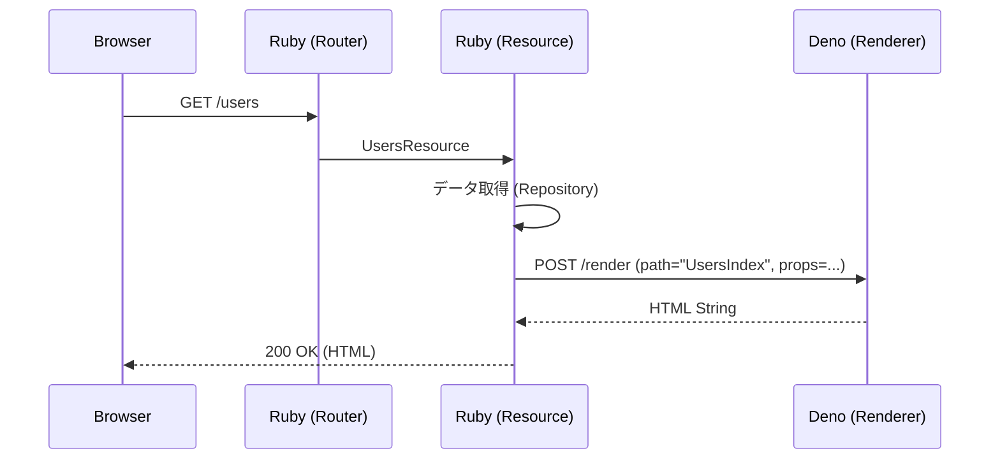

# アーキテクチャ設計

Lazuliは、Rubyの堅牢なバックエンドエコシステムと、Deno/Honoのモダンなフロントエンドレンダリング能力を組み合わせたハイブリッドフレームワークです。

## 1. プロセスモデル

Lazuliは Ruby (Rack) と Deno (Renderer/Assets) の **2プロセス** で動作します。

*   **Rack Process (Ruby):**
    *   アプリケーションのエントリーポイント (`config.ru`)。
    *   `Lazuli::App` として外部からのHTTPリクエストを処理します。
    *   ビジネスロジック、データベースアクセス、ルーティングを担当します。
*   **Renderer Process (Deno):**
    *   Unix Domain Socket (例: `tmp/sockets/lazuli-renderer.sock`) で待機します。
    *   **Hono JSX** によるSSR、アセット提供、Turbo Streams の `<template>` 断片（JSX fragment）生成を担当します。
    *   基本的にステートレスです。

### ライフサイクル（起動方法）

*   **開発/統合起動:** `lazuli dev` / `lazuli server` が `Lazuli::ServerRunner` として Rack + Deno を同時に起動し、終了シグナルで両方を確実に停止します。
*   **Rack単体起動:** `bundle exec rackup` は Rack のみ起動します（Deno spawn はしません）。Renderer は別プロセスで起動するか、CLIで統合起動してください。

### 起動シーケンス（lazuli dev/server）

1.  **Runner Boot:** `Lazuli::ServerRunner` が起動。
2.  **Socket Check:** 既存のソケットファイルを確認し、クリーンアップします。
3.  **Deno Spawn:** `deno run -A --unstable-net ...` でRendererを起動し、socket ready を待ちます。
4.  **Rack Spawn:** `bundle exec rackup` でRackサーバーを起動します。
5.  **Ready:** HTTPトラフィックの受け付けを開始します。

## 2. IPCプロトコル (Ruby <-> Deno)

通信はUnix Domain Socket上のHTTPで行われます。RubyがHTTPクライアント、DenoがHTTPサーバー (Hono) として動作します。

### エンドポイント

#### `POST /render`
Hono JSXコンポーネントをHTMLにレンダリングします。

*   **Request (JSON):**
    ```json
    {
      "path": "UsersIndex",   // app/views/UsersIndex.tsx へのパス
      "props": {              // データオブジェクト (シリアライズされたLazuli::Structs)
        "users": [
          { "id": 1, "name": "Alice" },
          { "id": 2, "name": "Bob" }
        ]
      }
    }
    ```
*   **Response (HTML):**
    ```html
    <!DOCTYPE html>
    <html>
      <head>...</head>
      <body>
        <div id="root">...rendered html...</div>
        <script type="module">...</script> <!-- Hydration scripts -->
      </body>
    </html>
    ```

#### `GET /assets/*`
静的アセットまたはオンデマンドでコンパイルされたJavaScriptを提供します。

*   **機能:**
    *   **オンデマンドトランスパイル:** `.tsx` ファイルへのリクエストを受け取ると、ブラウザで実行可能なJavaScriptに変換して返します。
    *   **Import Map解決:** サーバーサイドの `npm:` インポートを、ブラウザ互換の `https://esm.sh/` URLに自動的に書き換えます。これにより、複雑なバンドル設定なしでライブラリを使用できます。

## 3. リクエストライフサイクル



## 4. Island Architecture

Lazuliは **Island Architecture** を採用しており、ページ全体ではなく、必要な部分だけをインタラクティブにします。

*   **サーバーサイド:** `<Island />` コンポーネントは、ラップされたコンポーネントを静的HTMLとしてレンダリングし、同時にクライアントサイドでのHydration用の `<script>` タグを出力します。
*   **クライアントサイド:** ブラウザは生成されたスクリプトを実行し、`hono/jsx/dom` を使用して指定されたコンポーネントをマウントします。

## 5. ディレクトリ構成マッピング

| 概念 | Ruby パス | Deno パス |
| :--- | :--- | :--- |
| **Structs** | `app/structs/*.rb` | `app/types/*.d.ts` (推奨) |
| **Resources** | `app/resources/*_resource.rb` | N/A |
| **Views** | N/A | `app/views/*.tsx` |
| **Components** | N/A | `app/views/components/*.tsx` |
